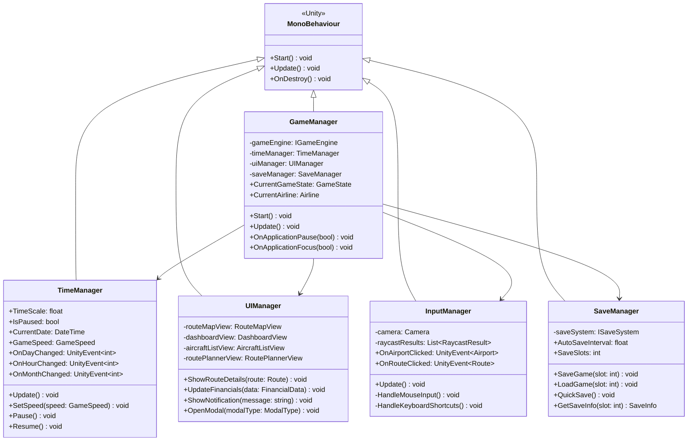
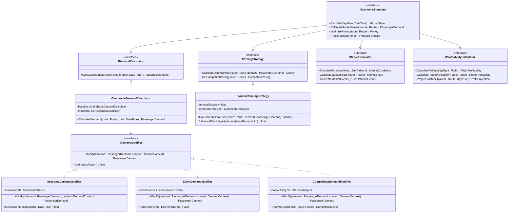
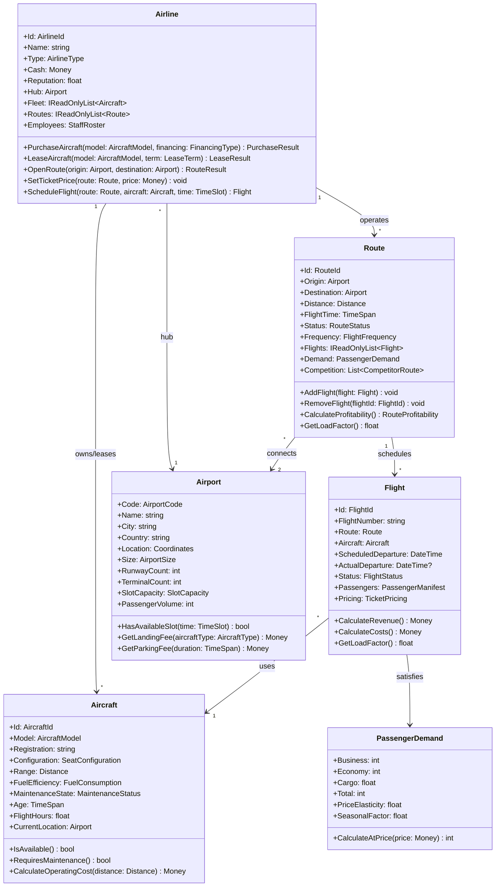
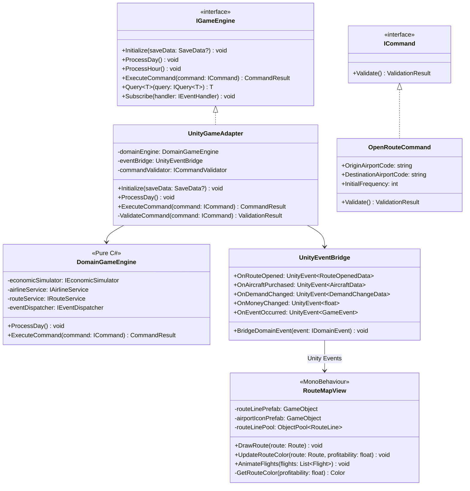
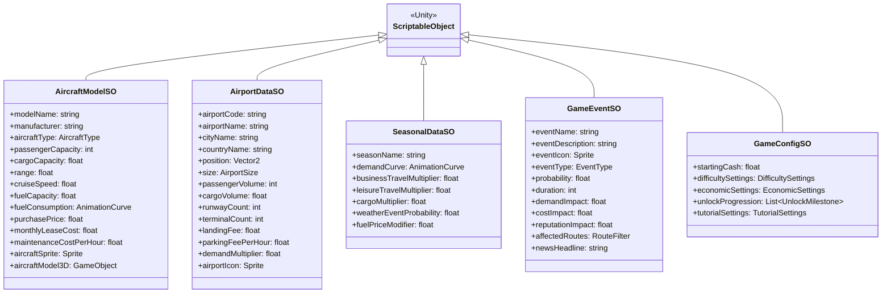
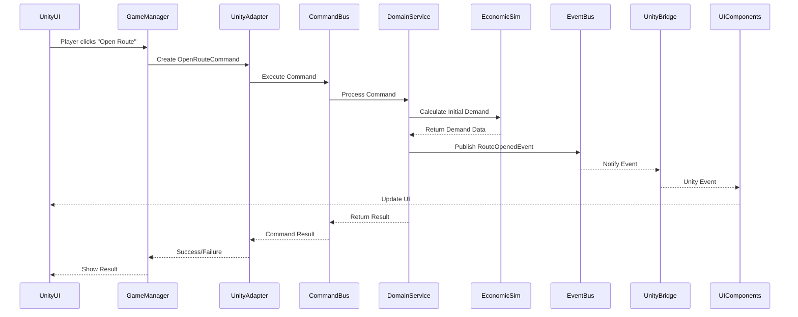
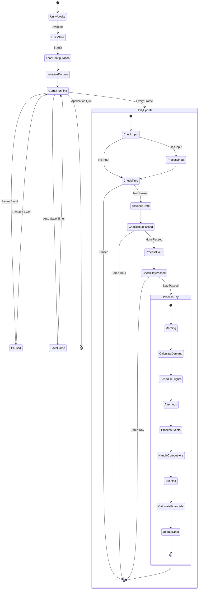

# Airline Tycoon Architecture

This document describes the technical architecture of Airline Tycoon, a Unity-based airline simulation game. The architecture follows SOLID principles, Domain-Driven Design patterns, and Unity best practices to create a maintainable, testable, and extensible codebase.

## Overview

Airline Tycoon uses a layered architecture that separates Unity-specific concerns from core business logic. This separation enables:

- **Testability**: Domain logic can be tested without Unity
- **Modularity**: Components can be developed and modified independently
- **Performance**: Optimized for Unity's rendering and update systems
- **Maintainability**: Clear boundaries between layers

### Core Principles

1. **SOLID Compliance**: Every component follows SOLID principles
2. **Composition over Inheritance**: Prefer component composition except for Unity MonoBehaviours
3. **Domain Isolation**: Business logic is independent of Unity
4. **Event-Driven**: Loose coupling through events
5. **Data-Driven**: Configuration through ScriptableObjects

## System Architecture

```mermaid
graph TB
    subgraph "Unity Presentation Layer"
        UICanvas[UI Canvas System]
        MapCamera[Map Camera Controller]
        UIControllers[UI Controllers/MonoBehaviours]
        Prefabs[UI Prefabs]
        Effects[Visual Effects]
    end

    subgraph "Unity Integration Layer"
        GameManager[GameManager : MonoBehaviour]
        TimeManager[TimeManager : MonoBehaviour]
        InputManager[InputManager : MonoBehaviour]
        SaveManager[SaveManager : MonoBehaviour]
        AudioManager[AudioManager : MonoBehaviour]
    end

    subgraph "Application Layer (Pure C#)"
        GameEngine[Game Engine]
        CommandBus[Command Bus]
        QueryBus[Query Bus]
        EventBus[Event Dispatcher]
        Validators[Command Validators]
    end

    subgraph "Domain Layer (Pure C#)"
        subgraph "Core Entities"
            Airline[Airline]
            Aircraft[Aircraft]
            Route[Route]
            Flight[Flight]
            Airport[Airport]
        end
        
        subgraph "Economic Simulator"
            DemandCalc[Demand Calculator]
            PricingEngine[Pricing Engine]
            MarketSim[Market Simulator]
            ProfitCalc[Profitability Calculator]
        end
        
        subgraph "Domain Services"
            Scheduling[Flight Scheduling]
            Optimization[Route Optimization]
            Maintenance[Maintenance Service]
        end
    end

    subgraph "Unity Data Layer"
        ScriptableObjects[ScriptableObject Configs]
        Addressables[Addressable Assets]
        Serialization[Unity Serialization]
        CloudSave[Cloud Save Service]
    end

    UIControllers --> GameManager
    GameManager --> GameEngine
    GameEngine --> CommandBus
    GameEngine --> QueryBus
    CommandBus --> Validators
    Validators --> Domain Services
    TimeManager --> GameEngine
    SaveManager --> Serialization
    EventBus -.-> Unity Integration Layer
    ScriptableObjects --> Domain Layer
```

## Unity Component Architecture

The Unity-specific components handle presentation, input, and engine integration while delegating business logic to the domain layer.



## Economic Simulator Design

The economic simulator is the heart of the game's business simulation. It's designed as a modular system that can be extended and tested independently of Unity.



## Domain Model

The domain model represents the core business concepts of an airline. These are pure C# classes that don't depend on Unity.



## Unity-Domain Bridge Pattern

This pattern allows Unity components to interact with the domain layer without coupling them directly.



## ScriptableObject Data Architecture

ScriptableObjects provide data-driven configuration that designers can modify without touching code.



## Event Flow Architecture

The event system enables loose coupling between components while maintaining clear data flow.



## Game Loop Integration

The game loop integrates Unity's update cycle with the domain's time-based simulation.



## Performance Optimization Strategies

### Object Pooling
```csharp
public class RouteLinePool : MonoBehaviour
{
    private Queue<RouteLine> pool = new Queue<RouteLine>();
    
    public RouteLine Get()
    {
        if (pool.Count > 0)
            return pool.Dequeue();
        return Instantiate(routeLinePrefab);
    }
    
    public void Return(RouteLine line)
    {
        line.gameObject.SetActive(false);
        pool.Enqueue(line);
    }
}
```

### LOD System for Map
- **Close**: Full route details, animated planes
- **Medium**: Simple lines, static plane icons  
- **Far**: Just route lines, no planes

### Update Batching
- Economic calculations run once per game day
- UI updates batched every 0.1 seconds
- Visual effects use Unity Job System

## Testing Strategy

### Domain Layer Testing (NUnit)
```csharp
[Test]
public void Route_CalculateProfitability_ConsidersAllCosts()
{
    // Arrange
    var route = new Route(jfk, lax);
    var flight = new Flight(route, boeing737, morningSlot);
    
    // Act
    var profitability = route.CalculateProfitability();
    
    // Assert
    profitability.Revenue.Should().BeGreaterThan(Money.Zero);
    profitability.Costs.Should().Include(c => c.Type == CostType.Fuel);
}
```

### Unity Integration Testing
```csharp
[UnityTest]
public IEnumerator GameManager_ProcessDay_UpdatesUI()
{
    // Arrange
    var gameManager = GameObject.Find("GameManager").GetComponent<GameManager>();
    var initialDate = gameManager.CurrentDate;
    
    // Act
    gameManager.ProcessDay();
    yield return new WaitForSeconds(0.1f);
    
    // Assert
    Assert.AreNotEqual(initialDate, gameManager.CurrentDate);
}
```

## Extension Points

The architecture provides clear extension points for new features:

1. **New Aircraft Types**: Add AircraftModelSO
2. **New Events**: Create GameEventSO  
3. **New Pricing Strategies**: Implement IPricingStrategy
4. **New Demand Modifiers**: Implement IDemandModifier
5. **New UI Views**: Create MonoBehaviour, subscribe to events

## SOLID Principles Applied

### Single Responsibility
- `DemandCalculator`: Only calculates demand
- `RouteMapView`: Only handles route visualization
- `SaveManager`: Only handles game persistence

### Open/Closed
- New features extend interfaces without modifying existing code
- ScriptableObjects allow data changes without code changes

### Liskov Substitution
- All strategy implementations are interchangeable
- Mock implementations for testing

### Interface Segregation
- Small, focused interfaces (e.g., `IDemandCalculator`, `IPricingStrategy`)
- Unity components only depend on needed interfaces

### Dependency Inversion
- Domain layer has no Unity dependencies
- All dependencies flow inward toward domain

## Conclusion

This architecture provides a solid foundation for Airline Tycoon that:
- Separates Unity concerns from business logic
- Enables comprehensive testing
- Supports iterative development
- Optimizes for Unity performance
- Allows designer-friendly configuration

The modular design ensures that new features can be added without disrupting existing functionality, while the event-driven architecture keeps components loosely coupled and maintainable.