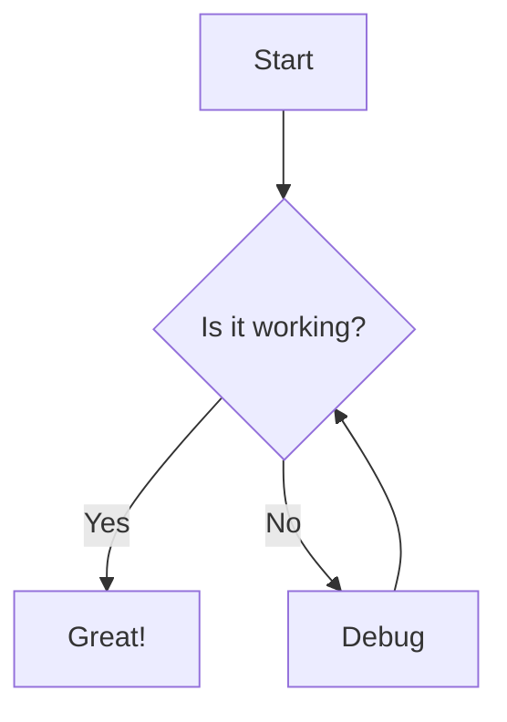
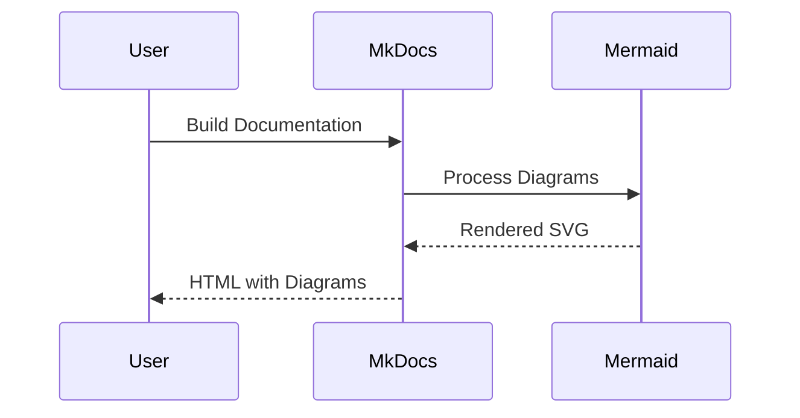
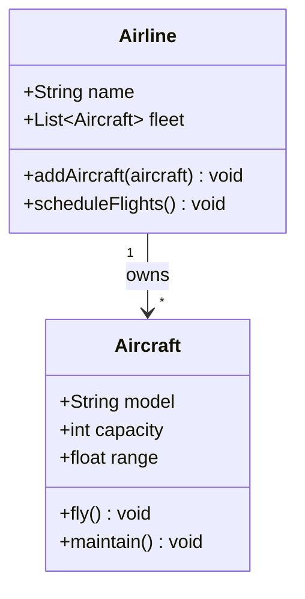

# Mermaid Test Page

This page tests that Mermaid diagrams are rendering correctly.

## Simple Flowchart

## Sequence Diagram

## Class Diagram

If you can see these diagrams rendered properly, then Mermaid is working correctly!